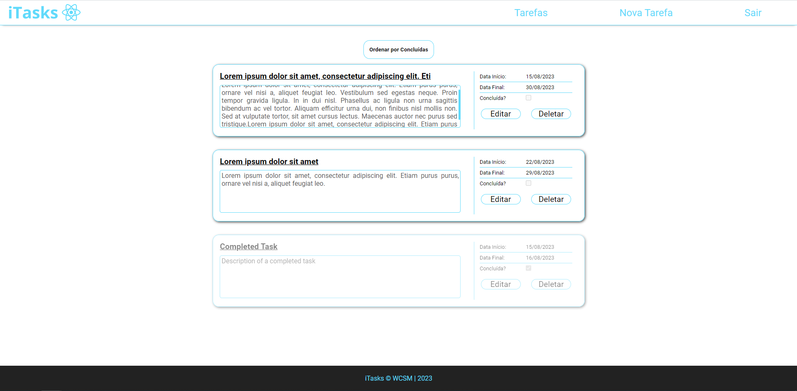

<h1 align="center">
  
iTasks

  
</h1>

  
  
  
  
  
  
  

## 💻 Introdução

iTasks é uma aplicação desenvolvida em **ReactJS** com **Vite**, focada no gerenciamento de tarefas, após criar seu usuário, você poderá criar/editar/deletar suas tarefas.

Backend desenvolvido em **Django Rest Framework** (acesse o repositório [clicando aqui](https://github.com/WallaceMartinsTI/iTasks_Backend)) e o Banco de Dados utilizado foi **Postgresql** rodando locamente na minha máquina.

## 🔨 Funcionamento

- Cadastro e Login de usuários;

- Tarefas vínculadas aos seus respectivos criadores;

- Criação, edição e deleção das tarefas;

## 💿 Instalação

Após baixar o projeto, navege até seu diretório e utilize o comando:

<code>npm install</code>

para instalar as dependencias necessárias e depois,
para rodar em modo desenvolvimento, utilize:

<code>npm run dev</code>

## ✔️ Tecnologias utilizada

- `ReactJS`
- `Typescript`
- `Vite`
- `Uuid`
- `Sass`

## 📄 Licença

Esse projeto está sob a licença MIT. Veja o arquivo [LICENSE](./LICENSE) para mais detalhes.
